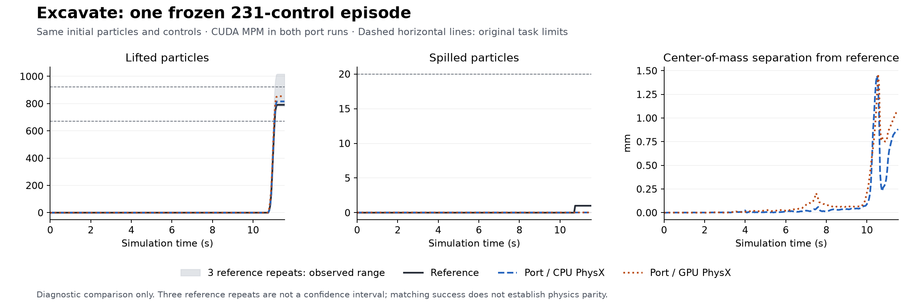

# Full Excavate CPU/GPU replay

The supervisor can now replay one frozen reference fixture with an explicit
`physx_cpu` or `physx_cuda` backend. It records the actual backend separately
from the physical fixture. Both fresh runs complete the original 231 controls
and succeed at step 230. This verifies a complete task replay on both backends;
calibrated physics parity remains unverified.

The first GPU attempt exposed a missing worker mount: SAPIEN tried to download
the PhysX GPU library inside the network-disabled container. The manager now
copies the existing library, verifies its pinned checksum before and after the
copy, and mounts it read-only in SAPIEN's cache. The failed attempt and corrected
retry have separate immutable job IDs and result hashes in the
[execution summary](verification/excavate-backends-summary.json).

## Fixed experiment and results

All runs use episode 0 of the original Excavate demonstration, seed 1, 12,115
particles, 4.543125 kg total mass and target 772. The portable reset, materials
and 231 `pd_joint_pos` controls are unchanged. The episode spans 11.55 simulated
seconds; each trace contains the initial state and 231 subsequent samples.
The [protocol](verification/excavate-backends-protocol.json) predates submission.
The [retry addendum](verification/excavate-backends-gpu-retry-protocol.json)
changes only the worker's offline dependency staging.

| Run | First success step | Final lifted | Final spilled | Final success |
| --- | ---: | ---: | ---: | --- |
| Original ManiSkill 2 reference | 230 | 791 | 1 | Yes |
| Current port, CPU PhysX + CUDA MPM | 230 | 816 | 0 | Yes |
| Current port, GPU PhysX + CUDA MPM | 230 | 854 | 0 | Yes |

Independent NumPy recomputation agrees with every recorded success label in
both fresh traces. Particle count and mass remain constant; all numeric frames
are finite. Both ports reproduce the exact independent initial-state hash,
fixture hash and actions. All 546 submitted simulator/native-build source files
are identical between the CPU and corrected GPU submissions and match the
[published source inventory](verification/excavate-backends-runtime-source-files.json).



The [CPU diagnostic](verification/excavate-backends-cpu-diagnostic.json) and
[GPU diagnostic](verification/excavate-backends-gpu-diagnostic.json) retain every
sample's aggregate errors and independently calculated outcomes. The maximum
COM separations are 1.447 mm and 1.465 mm, respectively. Maximum joint-position
errors are 0.000392 rad and 0.000330 rad. Individual particle-coordinate errors
reach 0.218443 m and 0.227002 m. Initial derived-pose errors also remain nonzero:
maximum translation errors are 2.962e-7 m and 5.215e-7 m. No older strict gate
has been widened or relabelled as a pass.

The earlier port run that spilled 31 particles remains a failed historical
result. Three independent reference repeats of this exact fixture finish with
892, 1,017 and 781 lifted particles, all with zero spills; one fails the amount
criterion. Their [observed variability](verification/excavate-backends-reference-variability.json)
is descriptive evidence, not a confidence interval or an acceptance limit.
One successful fresh run per backend cannot establish a success rate or prove
that all earlier physical differences have been fixed. Multiple independent
episodes and a predeclared aggregate acceptance protocol remain necessary.

## Reproduce and inspect

Use the [trusted supervisor copy](supervisor/README.md), the pinned worker image,
existing external reference assets, and the exported reset/action fixture.
Original meshes, particle arrays and native binaries are external inputs and
are not distributed with this report. The native actor adapter specification
is recorded in the protocol. For an individual job, pass
`candidate_sim_backend='physx_cuda'` (or `'physx_cpu'`) and that adapter
specification to `softbody_lab.remote_replay.prepare`; then submit and collect
the resulting immutable job with the same module. A conflicting backend in the
fixture is rejected. The flag never alters the reference simulator.

After collection, run the independent checker outside the candidate:

```sh
PYTHONPATH=/absolute/trusted/supervisor /absolute/python \
  /absolute/verification/compare_backend_replays.py \
  /absolute/reference/trace /absolute/candidate/trace \
  --backend physx_cuda --output /absolute/gpu-diagnostic.json
```

The checker rejects different fixtures, controls, sample times or execution
backends. A successful command means artifact integrity checks completed; read
the separately reported label mismatches and physical differences. It never
fits or declares a calibrated parity threshold. The plot can be regenerated
with `verification/plot_backend_replays.py` from the CPU/GPU diagnostic JSON
files and the reference variability JSON. Matplotlib is only needed to plot.

The final standalone supervisor passes 148 tests; six additional independent
checker tests detect incorrect backend metadata, altered controls and forged
success labels. The [validation record](verification/excavate-backends-validation.json)
pins their sources and commands. These synthetic tests supplement the actual
GPU evidence. The capture runner is byte-identical between fresh CPU and GPU
runs; the harness differences are dependency staging and an early fixture
conflict check, with hashes preserved in the job records.
