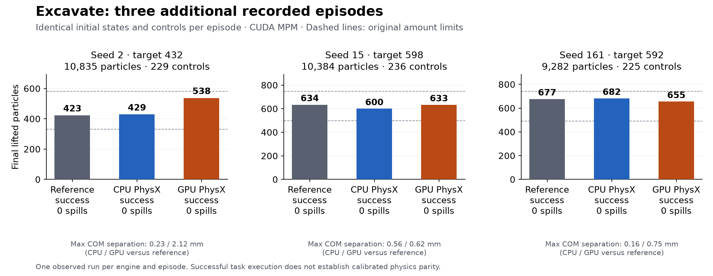

# Excavate across three additional recorded episodes

The unchanged port completes all six full replays across CPU and GPU PhysX,
with CUDA MPM in both configurations. Independent recomputation finds
6/6 final task successes and no mismatched success labels at any sample.
The three reference replays also succeed. This expands task coverage; it does
not establish calibrated physics parity or an out-of-sample success rate.

## Predeclared study

The [protocol](verification/excavate-diversity-protocol.json) selects original
Excavate dataset episode IDs 1, 2 and 3 in order, after the previously evaluated
episode 0. Selection occurred before running these episodes. The cases vary
particle count, terrain height, total mass, target count, robot initialization
and recorded controls. They do not cover new material types or all task geometries.
The protocol pins the official dataset revision and both downloaded file hashes.
Only native initial states and recorded controls enter the reference jobs;
future demonstration states and recorded outcomes are excluded.

Each clean reference run uses ManiSkill 2 commit
`493be36121a9dd06071a57172274babe617b789f`, its pinned image, Warp library and
SDF, and exports a verified portable reset/action fixture. Both candidate
backends receive that same fixture. All 546 submitted simulator/native-build
source files match commit `82a8ac339359de3a69edc6602a0fc74730e1d3e7`
and the [frozen source inventory](verification/excavate-diversity-source-inputs.json).
No physical runtime code or task thresholds changed for this study.

## Observed results

| Seed | Particles | Target | Controls | Lifted: reference / CPU / GPU | Spilled: reference / CPU / GPU | Final success: reference / CPU / GPU |
| --- | ---: | ---: | ---: | --- | --- | --- |
| 2 | 10,835 | 432 | 229 | 423 / 429 / 538 | 0 / 0 / 0 | Yes / Yes / Yes |
| 15 | 10,384 | 598 | 236 | 634 / 600 / 633 | 0 / 0 / 0 | Yes / Yes / Yes |
| 161 | 9,282 | 592 | 225 | 677 / 682 / 655 | 0 / 0 / 0 | Yes / Yes / Yes |



Every trace is complete and finite; particle count and per-particle mass stay
constant. The independent initial numeric state, fixture, controls, sample times
and actual backend metadata match their declared inputs. The checker recomputes
the original amount, spill and quiet-motion criteria at every frame, rather
than trusting the simulator's labels. The [summary](verification/excavate-diversity-summary.json)
records every candidate job and result hash; the [reference record](verification/excavate-diversity-references.json)
identifies all three reference jobs and independently computed outcomes.

| Seed | Max COM distance, CPU / GPU (mm) | Max particle coordinate error, CPU / GPU (m) | Max joint position error, CPU / GPU (rad) |
| --- | --- | --- | --- |
| 2 | 0.226 / 2.119 | 0.217797 / 0.229066 | 0.000744 / 0.004597 |
| 15 | 0.556 / 0.615 | 0.236171 / 0.237327 | 0.000401 / 0.001340 |
| 161 | 0.161 / 0.754 | 0.225055 / 0.222428 | 0.000473 / 0.005072 |

Initial derived link poses still differ at floating-point scale. Individual
particle trajectories diverge substantially despite the observed task successes.
For seed 2, the GPU run lifts 538 particles against the reference's 423, within
the original task interval. Neither that interval nor these observed errors is
a calibrated parity tolerance. No earlier strict gate has been widened or
relabeled. The [earlier Excavate failures and reference variation](excavate-backends.md)
remain part of the record. This is one observed run per engine and episode;
repeated independent references and a protected acceptance set remain necessary.

## Durable reference jobs and reproduction

The [trusted supervisor](supervisor/README.md) now supports native reference-demo
jobs through `remote_replay.prepare_reference_demo`. They share the existing
bounded GPU queue, immutable request, resume, observation and collection paths
with candidate jobs. Collection verifies the pinned reference source, image,
input identities and exported fixture. Per-case `candidate_sim_backend` in the
coding loop now forwards CPU/GPU selection without overriding the independent
comparison. The live matrix used the direct job API; forwarding and failure
propagation in the coding loop were tested locally.

Run the existing `verification/compare_backend_replays.py` on each external
reference/candidate trace, as shown in the [single-episode instructions](excavate-backends.md).
The private study directory also contains `protocol.json`, `candidate-inputs.json`,
`verification-inputs.json`, the frozen `verification/` code and
`episode-N/{reference,physx_cpu,physx_cuda}/collected` jobs. Preserve the original
checksummed configuration; its local paths are omitted from the public inventory.
With that complete directory and the trusted harness:

```sh
PYTHONPATH=/absolute/trusted/supervisor PYTHONDONTWRITEBYTECODE=1 \
  /absolute/python -P /absolute/verification/analyze_excavate_diversity.py \
  /absolute/private/study

python /absolute/verification/plot_excavate_diversity.py \
  /absolute/verification/excavate-diversity-summary.json /new/outcomes.png
```

The study analyzer rejects changed frozen inputs, candidate runtime sources,
image, harness, backend, and previously audited diagnostic output. It reports
outcomes and errors without fitting limits or declaring acceptance. The public
record contains code, hashes, scalar diagnostics and a plot; original assets,
particle arrays and native binaries remain external inputs under their source terms.

The packaged supervisor passes 167 local tests, including reference-job input
separation, changed provenance, expired budgets and CPU/GPU forwarding with a
failing independent verdict. Six frozen checker tests cover altered controls,
incorrect backend metadata and forged success labels. Tests supplement the live
nine-job evidence; they do not turn trajectory differences into physics passes.
The [validation record](verification/excavate-diversity-validation.json) pins
the tested sources, commands, source-inventory audit and inspected plot.
