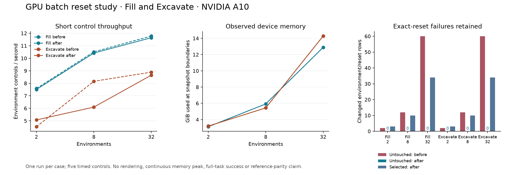

# GPU batch reset isolation at 2, 8 and 32 environments

The selected-joint reset fix preserves the captured state of every untouched
environment exactly in all six repeated Fill/Excavate cases, including native robot-link state. The
baseline changed untouched state in 148 environment/reset comparisons;
the repeat changes none. All six strict overall verdicts still fail because
94 selected checkpoint-restoration comparisons retain floating-point
differences. These runs establish a specific reset-isolation improvement,
not calibrated reference parity or completion of the soft-body port.

## Experiment and retained failures

The [protocols](verification/gpu-scaling-protocols.json) declare Fill and Excavate
at 2, 8 and 32 environments, with seeds 101 onward in environment order, before
running the cases. The first two-environment capture included only the MPM
coupling bodies and omitted robot links. Its numerical verifier rejected that
capture. The [original failure](verification/gpu-scaling-initial-capture-failure.json)
is retained; the other five cases in that initial version were never submitted.

The corrected capture records the union of every robot link and coupling body
and rejects omitted coverage. Six baseline jobs then ran at fork commit
`452c4098b51d6d86cc7d58415bf41010d4f2bf88`. After the reset fix, the same six
cases ran with identical frozen capture code, controls and exact numerical gates.
All twelve completed job archives were downloaded and independently reaudited.
The [before](verification/gpu-scaling-before.json) and
[after](verification/gpu-scaling-after.json) records include every changed row,
per-field errors, job/input/result identities, and actual native binary hashes.

The tasks retain their original particle recipes, material values, timesteps
and padded capacities. Fill has 704 live particles per environment. Across the
Excavate seeds, live counts range from 9,131 to 13,678. The diagnostic uses
GPU PhysX and CUDA MPM on one NVIDIA A10, with independent MPM models in the
shared native world. Nonzero joint-position drive targets produce all controls;
only reset APIs assign physical state.

## Results

"Untouched changes" counts changed environment/reset comparisons across the
partial checkpoint restore and fresh partial reset. "Selected failures" counts
selected rows that differ after partial or full checkpoint restoration. It does
not count individual coordinates or test functions.

| Case | Untouched changes: before / after | Selected failures after | Median control (s) | Env controls/s | Observed GPU GiB |
| --- | ---: | ---: | ---: | ---: | ---: |
| Fill-N2 | 2 / 0 | 3 | 0.267 | 7.50 | 3.12 |
| Fill-N8 | 12 / 0 | 10 | 0.768 | 10.42 | 5.92 |
| Fill-N32 | 60 / 0 | 34 | 2.749 | 11.64 | 12.88 |
| Excavate-N2 | 2 / 0 | 3 | 0.394 | 5.07 | 3.20 |
| Excavate-N8 | 12 / 0 | 10 | 1.312 | 6.10 | 5.44 |
| Excavate-N32 | 60 / 0 | 34 | 3.700 | 8.65 | 14.28 |



Every exposed particle checkpoint matches the actual solver arrays, including
inactive padding. All snapshots are finite, particle mass/count stay constant
during each rollout, scene ownership and native row separation pass, and all
audited random streams and elapsed counters follow their declared reset scope.
Native model inputs remain unchanged. Rebuilding the scene reproduces each
initial state exactly. Unselected exposed state already passed in the baseline;
the discovered defect was visible in the additional native robot-link readback.

The remaining selected-state errors affect native rigid-body and exposed
articulation state, at magnitudes up to
9.53674316e-07 in their recorded
numeric fields. These strict failures remain failures. The checker does not
replace them with a fitted tolerance or a successful process exit.

## Why the change works

In the [pinned SAPIEN 3.0.3 implementation](https://github.com/haosulab/SAPIEN/blob/731622eac5b140b320076c8a1b6eb4b553c3ccd4/src/physx/physx_system.cpp#L853), the indexed joint position, velocity,
force and target methods submit the internal index-buffer prefix instead of
the caller's indices. The previous workaround resent all joint rows. PhysX
then marked untouched articulations for kinematic recomputation, perturbing
their native link transforms and velocities during another environment's reset.

The native adapter now submits the selected global articulation indices with
the existing full native joint buffers to `PxScene::applyArticulationData`.
It checks native type/initialization and index validity, and synchronizes CUDA
before releasing the temporary buffer. Soft-body partial resets use this path;
full resets and ordinary rigid scenes retain their existing native calls.
The [native build instructions](native/README.md) explain the pinned ABI and
required rebuild. The [build record](verification/gpu-scaling-native-build.json)
identifies the compiled extension used in all six repeats.

The [source inventory](verification/gpu-scaling-source-inputs.json) pins all 546
submitted runtime/build files. Exactly three differ between baseline and repeat:
`scene.py`, `sapien303.py` and `actor_bridge.cpp`. Native documentation was updated
after submission and is recorded separately. Per-job Warp binaries are recorded
individually; rebuilding unchanged Warp source does not imply byte-identical
library files. The study used the same pinned candidate image and PhysX GPU
library throughout.

## Scope and reproduction

Timing is the median of five synchronized `env.step` calls after two warmups,
including observations and excluding rendering and snapshot I/O. There is one
run per case/version, so small differences between versions are not evidence
of a speed improvement. The reported device-memory maximum is sampled at ten
snapshot boundaries; it is not a continuously measured peak. Torch allocator
metrics and Linux process high-water RSS are recorded separately.

Ten snapshots cover initialization, stepping, reversed selected checkpoint
restoration, fresh selected reset, reversed full flat-state restoration, their
continuations and scene reconstruction. This is short-control lifecycle and
scaling evidence. Full-task performance, GPU rendering, all six task families
at these batch sizes, updated wheel installation, and independently calibrated
reference acceptance remain separate work.

Preserve the complete private study directories and immutable job handles. Run
the [aggregation script](verification/analyze_gpu_scaling.py) from outside the
candidate checkout with the original frozen trusted harness:

```sh
PYTHONPATH=/absolute/scaling-v2/harness PYTHONDONTWRITEBYTECODE=1 \
  /absolute/python -P /absolute/verification/analyze_gpu_scaling.py \
  /absolute/scaling-v2 --protocol-sha256 39f6500f57e52f6d838fdd18bbcd0081e9ef1a357cf626aebd6fbbaf9eb3dde3

PYTHONPATH=/absolute/scaling-v2/harness PYTHONDONTWRITEBYTECODE=1 \
  /absolute/python -P /absolute/verification/analyze_gpu_scaling.py \
  /absolute/scaling-v3 --protocol-sha256 98f48bb2b3c3b5195a7b8f97c47a16a2826ade5a8c47ec4aa135e12a5322014e
```

Aggregation was added after capture. It revalidates the original archives,
protocol, sources and harness, reruns the unchanged frozen numerical evaluator,
and rejects a changed saved verdict. The general
[supervisor instructions](supervisor/README.md) cover preparation and collection.
Only code, hashes, scalar evidence and the plot are published; raw arrays,
original assets, credentials and native binaries remain external inputs.

The [validation record](verification/gpu-scaling-validation.json) records 235
passing local checks: 214 supervisor tests, 14 reset API tests and seven report
audit tests. Those tests cover forged provenance, omitted native coverage,
late-row failures and retained selected-state failures. They complement the
live GPU evidence and do not clear its remaining strict physics gates.
